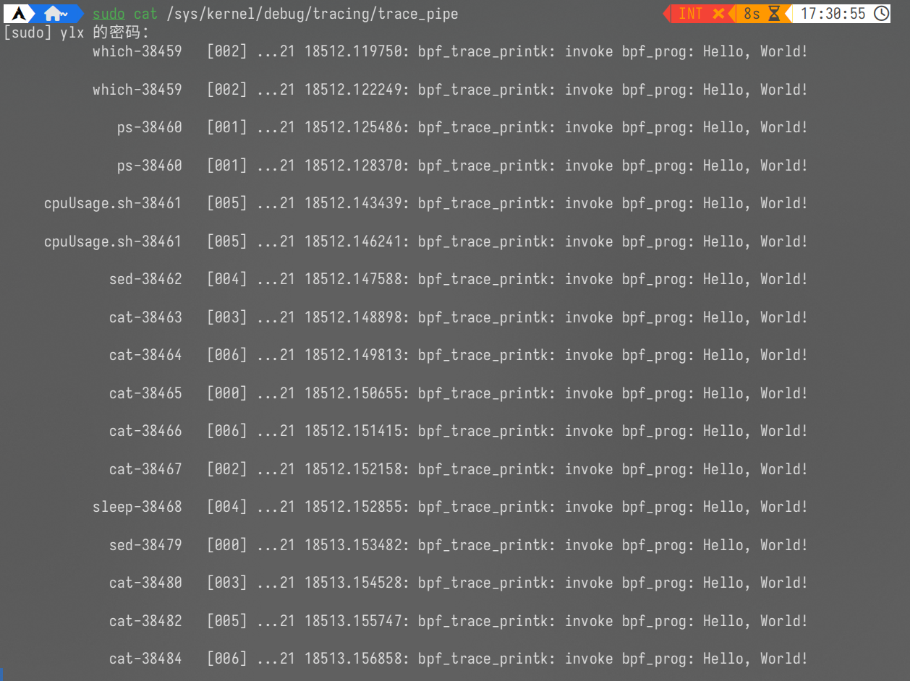

# 构建一个libbpfgo

## 环境配置

在环境配置中，要安装 clang llvm bpftool libbpf。

```sh
sudo pacman -S libbpf clang llvm bpftool
```

拉取 cilium 的仓库，该仓库中包含了一些构建内核代码的头文件等内容。

```c
git clone https://github.com/cilium/ebpf.git
```

## 编写代码

一个bpf程序包含内核态程序和用户态程序，在这里分别对应的为 helloworld.c 和 main.go 。

helloworld.c：

```c
#include "/home/ylx/ebpf/examples/headers/common.h"//需要替换为自己拉取 cilium 仓库的路径，或者设置环境变量
SEC("tracepoint/syscalls/sys_enter_execve")

int bpf_prog(void *ctx) {
  char msg[] = "Hello, World!";
  // 输出一行内核调试日志
  // 可以通过 / sys/kernel/debug/tracing/trace_pipe 查看到相关日志输出
  bpf_printk("invoke bpf_prog: %s\n", msg);
  return 0;
}

char LICENSE[] SEC("license") = "Dual BSD/GPL";
```

main.go

```go
package main

import (
    "log"
    "os"
    "os/signal"
    "syscall"

    "github.com/cilium/ebpf/link"
    "github.com/cilium/ebpf/rlimit"
)

func main() {
    stopper := make(chan os.Signal, 1)
    signal.Notify(stopper, os.Interrupt, syscall.SIGTERM)

    // Allow the current process to lock memory for eBPF resources.
    if err := rlimit.RemoveMemlock(); err != nil {
        log.Fatal(err)
    }

    // Load pre-compiled programs and maps into the kernel.
    objs := bpfObjects{}
    if err := loadBpfObjects(&objs, nil); err != nil {
        log.Fatalf("loading objects: %s", err)
    }
    defer objs.Close()

    //SEC("tracepoint/syscalls/sys_enter_execve")
    // attach to xxx
    kp, err := link.Tracepoint("syscalls", "sys_enter_execve", objs.BpfProg, nil)
    if err != nil {
        log.Fatalf("opening tracepoint: %s", err)
    }
    defer kp.Close()

    log.Printf("Successfully started! Please run \"sudo cat /sys/kernel/debug/tracing/trace_pipe\"to see output of the BPF programs\n")

    // Wait for a signal and close the perf reader,
    // which will interrupt rd.Read() and make the program exit.
    <-stopper
    log.Println("Received signal, exiting program..")
}
```

## 编译运行

1. 生成go.mod文件并自动管理依赖

   ```sh
   go mod init {项目名称}
   go mod tidy
   ```

2. 将 helloworld.c 转换为 go 文件并生成 bpf 字节码

   安装 bpf2go ，使用该工具将内核态的程序转换成为 go 文件并编译。

   ```sh
   go install github.com/cilium/ebpf/cmd/bpf2go@latest
   ```

   编译 helloworld.c

   ```sh
   GOPACKAGE=main bpf2go -cc clang-10 -cflags '-O2 -g -Wall -Werror' -target bpfel bpf helloworld.bpf.c \
    -- -I /usr/src/debug/bpftool/bpftool/libbpf/include/uapi \ #注意需要替换成自己 bpftool 所在的路径
       -I /usr/local/bpf/include \
       -idirafter /usr/local/include \
       -idirafter /usr/lib/llvm14/lib/clang/14.0.6/include \
       -idirafter /usr/include/x86_64-linux-gnu \
       -idirafter /usr/include
   Compiled /home/ylx/桌面/wlx-dm/go/libbpfgo/bpf_bpfel.o
   Stripped /home/ylx/桌面/wlx-dm/go/libbpfgo/bpf_bpfel.o
   Wrote /home/ylx/桌面/wlx-dm/go/libbpfgo/bpf_bpfel.go
   ```

   在编译过程中可能遇到 clang 与 llvm 版本不匹配的问题。这时可以使用软链接的形式构建对应版本的文件。

   ```sh
   sudo ln -s /usr/bin/llvm-strip /usr/local/bin/llvm-strip-10
   sudo ln -s /usr/bin/clang /usr/local/bin/clang-10
   ```

3. 运行ebpf程序

   main.go 作为ebpf的用户态程序会将由 helloworld.c 生成的 bpf_bpfel.go 加载到内核中运行。

   ```c
   go run -exec sudo main.go bpf_bpfel.go
   ```

4. 查看输出

   ```sh
   cat /sys/kernel/debug/tracing/trace_pipe
   ```

   
