# 分享

## 什么是内核？

小组的各位同学都安装了 Linux 系统，Ubuntu Arch 等等。那么 Linux 内核和这些操作系统之间存在什么关系？

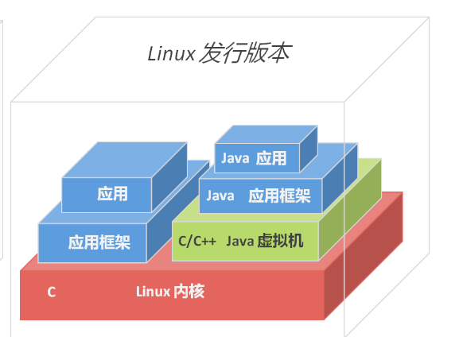

如上图中所示，各个发行版是在内核的基础上添加了更加方便的各类基础工具，如系统工具、图形界面、应用程序等。

## 内核当中都有什么？

Linux内核自上世纪90年代诞生以来，历经三十多年的不断迭代发展。最终形成了以下五大板块。

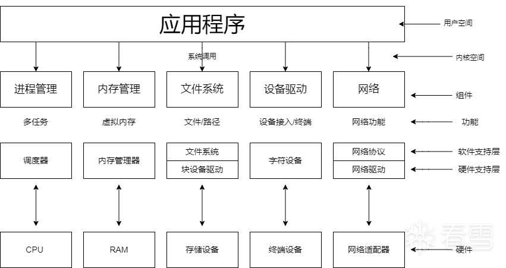

他们之间各自管理不同的领域，但又紧密联合。

## 为什么学习内核？

### 内核的广泛应用

#### 内核与云原生

Docker 是一种轻量级的容器化技术，能够将应用程序及其依赖项打包成一个独立的可移植的容器，从而实现快速部署、可移植性和资源隔离。在云原生生态系统中，容器化技术被广泛采用，而 Docker 正是其中最流行和最广泛使用的容器化引擎之一。

而容器实现的核心就是通过约束和修改进程的动态表现，从而为其创造出一个“边界”。而这个边界的创造则正是通过内核提供的 Namespace 机制 Cgroups 机制与 Rootfs根文件系统所创造的。

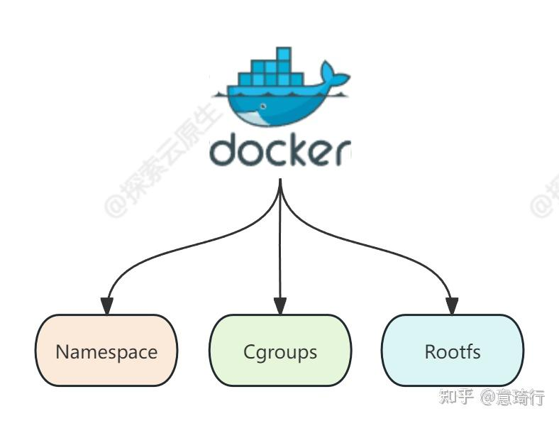

* Linux Namespace 的隔离能力
* Linux Cgroups 的资源限制能力
* 基于 rootfs 的文件系统

原文地址：https://zhuanlan.zhihu.com/p/673638788?utm_psn=1767969065782796289

#### 内核与嵌入式

嵌入式驱动开发：

嵌入式驱动程序通过系统调用将程序注册为内核模块。内核模块会被与内核一同编译执行。如果内核模块编写不规范，则会导致整个系统的崩溃。

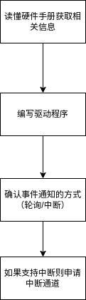

内核的裁剪与移植：

随着科技的不断发展各类智能穿戴设备、物联网设备应运而生。基于单片机的嵌入式开发已经不满足于人们的多样化需求。诸如树莓派这些开发板集成了处理器、内存、外设接口等硬件组件，其上预装了一个或多个操作系统，如Linux、FreeRTOS、RTOS等。

那么每个硬件平台之间都存在着细微的差别，要在开发板上安装系统，就要对操作系统内核进行裁剪与移植。而这项工作的前提就需要对内核代码有一定了解。

同时也有企业会开发自己的嵌入式操作系统，在进行操作系统开发时，也会借鉴 Linux 内核中经典的设计思想。如下图中腾讯的物联网操作系统平台。

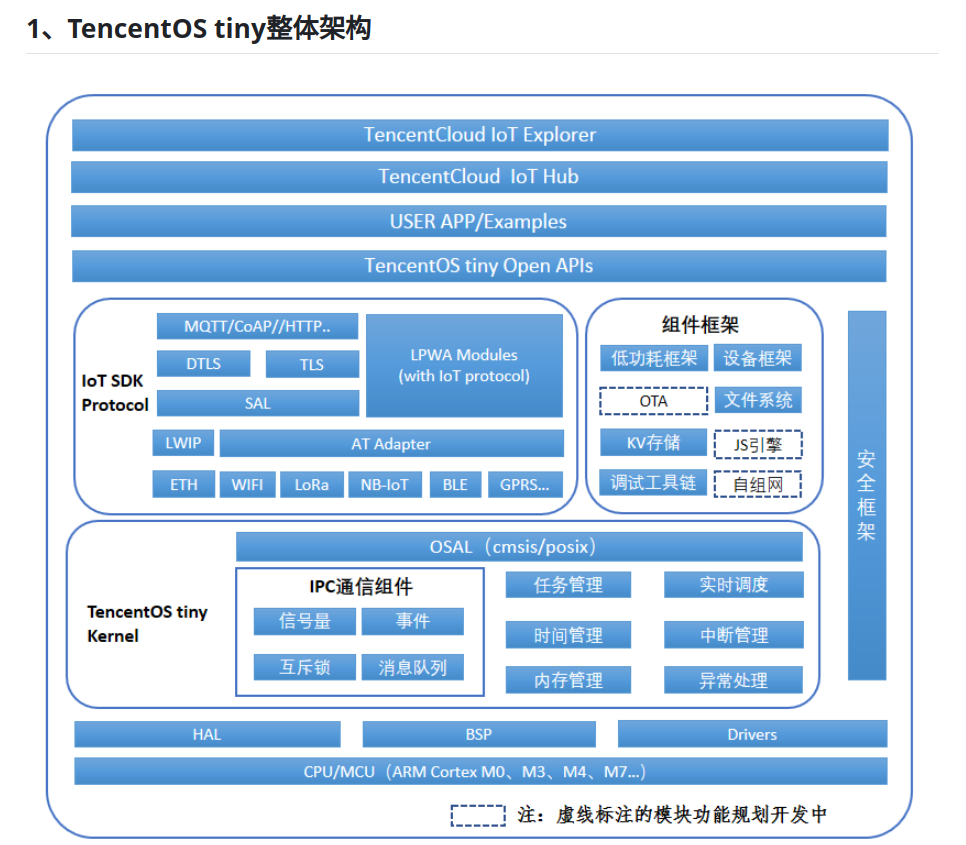

当然内核的应用不止于以上两个例子中涉及的领域，他在数据库，网络，信息安全都发挥着重要的作用。

### 内核经典设计思路的共通之处

Linux 内核通过多年发展，凝结了诸多优秀计算机工程师的智慧。学习内核的过程也是对自身思想提高的一个过程。

#### 面向对象的设计思想

Linux 内核虽然多使用C语言这一面向过程的语言编写，但是其中有不少内容都用到了面向对象的思想。最典型的即为 VFS 虚拟文件系统。

为了实现 一切对象皆是文件 这个目标，Linux 内核提供了一个中间层：虚拟文件系统。而虚拟文件系统类似于面向对象中的接口，定义了一套标准的接口。开发者只需要实现这套接口，即可以使用操作文件的接口来操作对象。如下图所示：

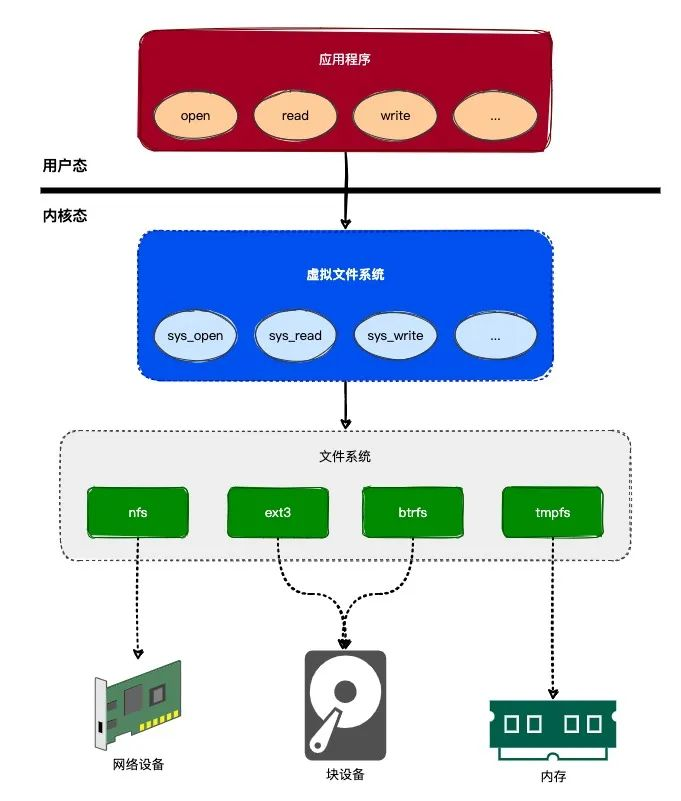

#### 多种数据结构的应用

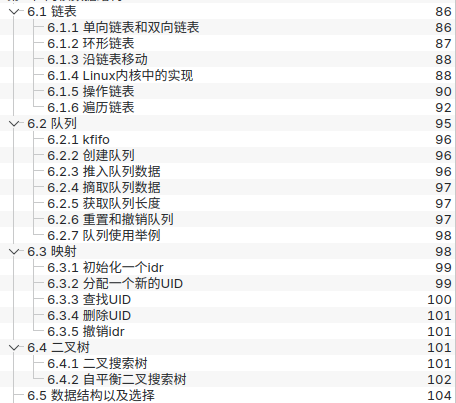

#### 算法

* CFS（完全公平调度器）：通过红黑树、vruntime等将之前多链表表示不同优先级的调度算法简化。
* LRU：LRU算法根据数据的历史访问记录来进行淘汰数据，其核心思想是“如果数据最近被访问过，那么将来被访问的几率也更高”。这一算法不仅被应用在内核的swap机制中。在数据库等其他领域也有所使用。

上述只是一些例子，更多的思想光辉还需要我们大家一起去探索发现。

### 来自学姐学长的真实反馈

图中的几位都是小组大三大四或者毕业一两年的学姐学长。他们刚刚经历了面试，可以给我们更加真实的就业反馈。

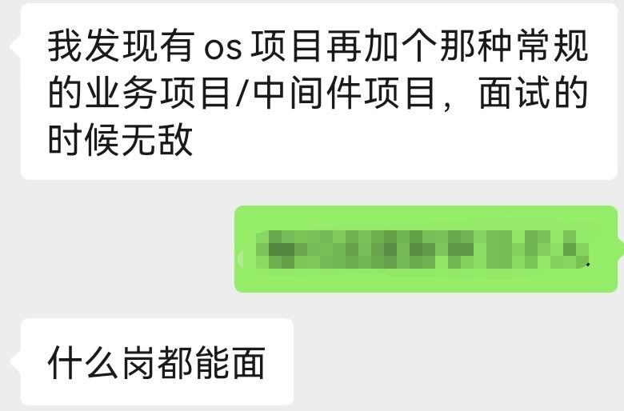

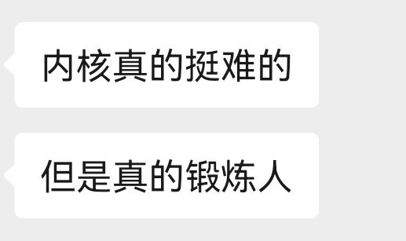

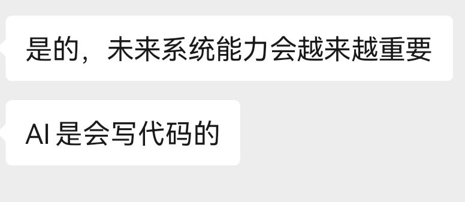

## 关于内核的学习？

### 我们做了什么？

#### 《操作系统真相还原》

在大二上半学期中，我们首先简单的学习了 X86 架构汇编语言。

之后我们主要学习了《操作系统真相还原》这本书，并根据书中源码实现了一个 X86 架构下32位小型操作系统内核。

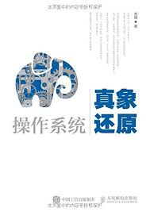

该操作系统中包含了上图中除了网络之外的其他四部分的简易实现。支持多线程多进程，内存管理，与ext2文件系统，并在此基础上实现了简单的系统调用如 read write fork 等。可以通过终端命令行的形式使用如 ls cd pwd 等基础命令操作。

#### 基于 LoongArch 的操作系统 —— kernel-travel

项目的github链接：https://github.com/xiyou-linuxer/kernel-travel

该项目是一个基于 LoongArch 架构的小型操作系统。也是我们最近在忙的事情

在该项目中，我们当前已经实现了如下部分

中断与错误处理：

* 中断向量表的初始化
* 时钟中断
* tlb错误处理
* io中断路由的设置

进程管理：

* 线程的调度
* 用户进程

内存管理：

* 配置直接映射窗口
* 物理内存的管理
* 虚拟内存的管理（三级页表）

部分驱动：

* uart
* pci总线驱动
* 磁盘驱动

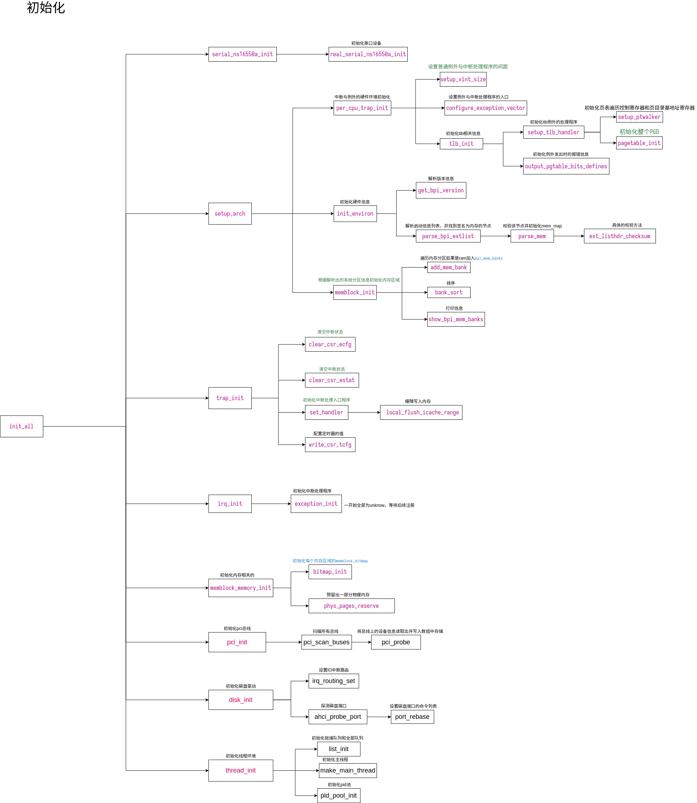

最终完成后可在如图所示的物理开发板上运行。通过接入的一个串口终端，将内容输出的串口终端上。

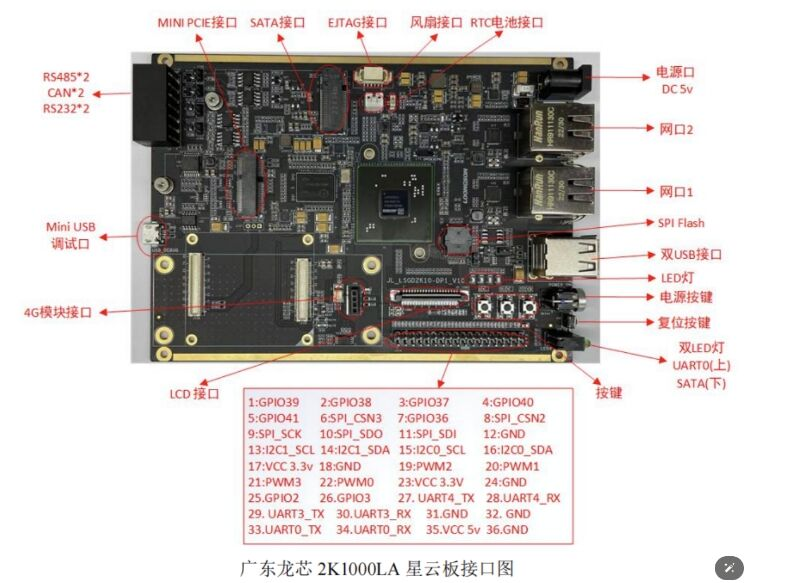

### 我们未来打算做什么？

#### 更加深入的了解内核——阅读并迁移内核2.4源码

前文中提到的两个小型操作系统只是对于操作系统的简易实现。可以帮助我们在宏观上知道操作系统大致的运作规律。但是对于细节之处距离真正的内核代码还是相去甚远。

在未来我们会继续阅读内核源码。以2.4版本为主，并参考更多高版本内核源码，在 kernel-travel 的基础上将更多内核的特性迁移至其中。

同时也希望小组更多的同学有时间能参与到 kernel-travel 这一项目的建设当中去。

#### 基于内核的现代工具——eBPF与更多性能监测工具

eBPF 技术被称为“解锁内核的工具” 在后续的学习中，我们也学会使用各类系统监控工具，帮助我们能够更加深入的了解内核。同时eBPF技术也是当下流行的工具之一，对于内核的理解也有助于我们迅速掌握这一工具的使用。

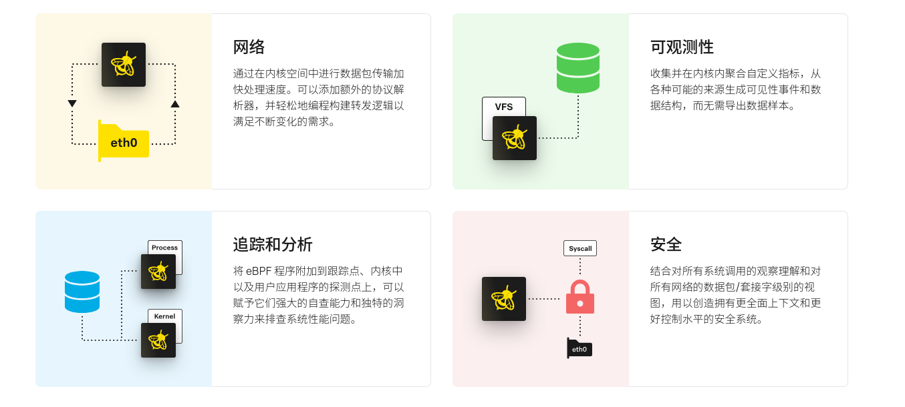

无论是我们做过的事还是打算做的事，都是小组往届学姐学长为我们探索出的道路。我们也会在学姐学长的基础上去了解尝试更多不同事情，将小组内核学习的路线建设的更加清晰完整。

## 结语

最后我想说两点：
首先我们在学习计算机这一学科时，不应该去畏惧未知的技术。也不要对庞大的代码感到恐惧。带着目的去从自己想要的东西开始看起，逐渐了解整个项目的架构。当你开始后，就不会再觉得十分困难。

最后，学内核不止于学内核，而学后端不止于学后端。从前面的内容中我们已经看到，不管是学习内核还是学习其他方向都需要在本身的方向上做出更多拓展。我们要有所侧重的学习毕竟时间有限，但是也不能目光狭隘，只盯在自己选择的方向上。闲暇之余和小组内其他方向的同学，和学校内其他方向的同学应该多多交流，或者在网上刷刷帖子都是了解信息的绝佳方式。希望大家能开阔眼界不拘一格。

