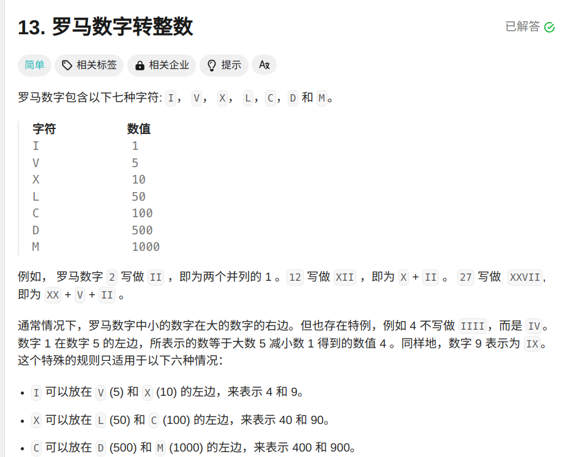

```cpp
class Solution {
private:
 unordered_map<char, int> symbolValues = {
        {'I', 1},
        {'V', 5},
        {'X', 10},
        {'L', 50},
        {'C', 100},
        {'D', 500},
        {'M', 1000},
    };//将字母与对应数字存入哈希表
public:
    int romanToInt(string s) {
        int sum =0 ;
        int n = s.length();
        for(int i=0;i<n;i++){
            int value = symbolValues[s[i]];获取当前字符所代表的值
            if(i<n-1&&value<symbolValues[s[i+1]]){//如果当前值有下一个值且小于下一个的值
                sum-=value;//则总和应该减去当前值
            }else{
                sum+=value;//否则加上当前值
            }
        }
        return sum;
    }
};
```
按照罗马数字的排列规律可知，当小的数字在大数的右边则需要用大的数字减去小的数字，若在左边则是加上。\
例如IV是5-1=4,VI是5+1=6