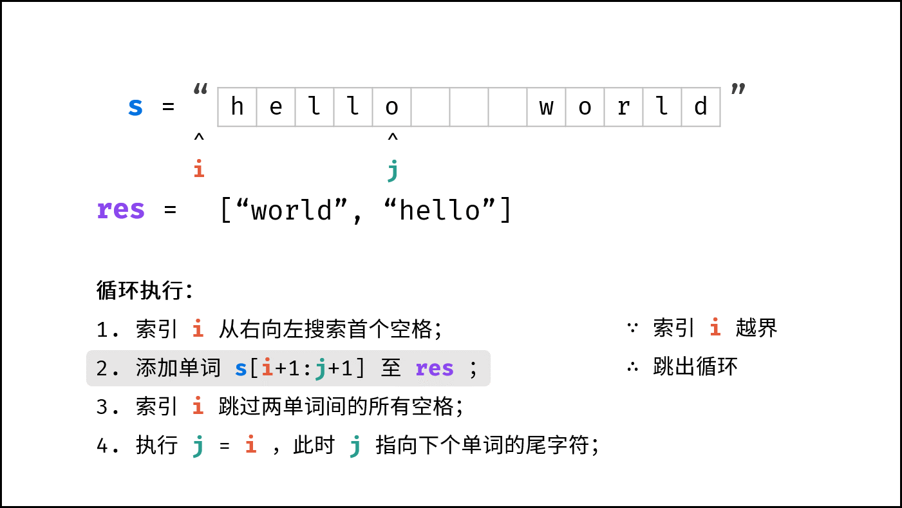

```
class Solution {
public:
    std::string reverseWords(std::string s) {
        // 删除首尾空格
        s.erase(0, s.find_first_not_of(" "));
        s.erase(s.find_last_not_of(" ") + 1);

        int j = s.length() - 1, i = j;
        std::stringstream res;//输入流
        while (i >= 0) {
            while (i >= 0 && s[i] != ' ') i--; // 搜索首个空格
            res << s.substr(i + 1, j - i) << " "; // 添加单词
            while (i >= 0 && s[i] == ' ') i--; // 跳过单词间空格
            j = i; // j 指向下个单词的尾字符
        }

        std::string result = res.str();//转换成字符串
        result.erase(result.find_last_not_of(" ") + 1); // 删除末尾空格
        return result;
    }
};

```
使用了双指针的方式，反向遍历。
