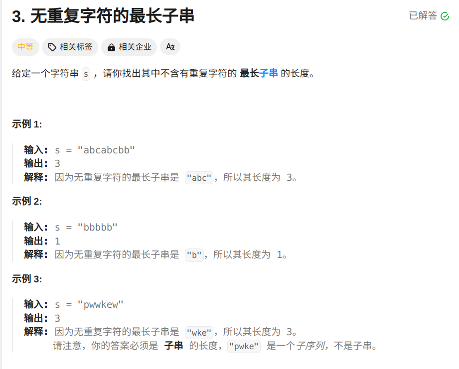
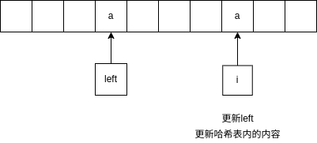

代码：
```cpp
class Solution {
public:
    int lengthOfLongestSubstring(string s) {
         unordered_map<char,int> hash_map;
         int ans = 0,left = 0;
         int i;
         for(i = 0;i<s.length();i++)
         {
            char cur = s[i];
            if(hash_map.count(cur)){//如果哈希表中已经有该字符
                ans = max(ans,i-left);//比较当前最长字符串大小，和新串大小谁的更大
                left = max(left,hash_map[cur]+1);//比较当前记录的最左端的值和重复字符的值哪个更大
            }
            hash_map[cur] = i;//更新哈希表中的内容
         }
        return max(ans,i-left);//返回最长字串的长度
    }
};
```
思路：记录字符串出现的最右端的值，如果重复出现，就比较
