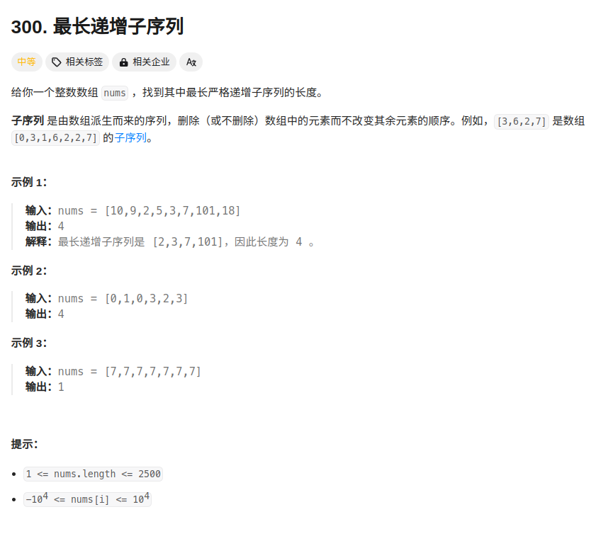
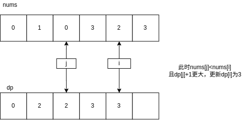

```cpp
class Solution {
public:
    int lengthOfLIS(vector<int>& nums) {
        
        int n = nums.size();
        if(n==0){
            return 0;
        }
        vector<int> dp(n,0);//dp数组中记录的值是从0,到i,这段距离中递增的数字个数。
        for(int i=0;i<n;i++){//依次遍历数组中的所有数字
            dp[i] = 1;
            for(int j=0;j<i;j++){//遍历当前指向位置之前的所有数字
                if(nums[j]<nums[i]){//如果前面有某个数字小于当前位置指向的数字则根据前面dp数组中保存的内容更新dp[i]
                    dp[i] = max(dp[i],dp[j]+1);
                }
            }
        }
        return *max_element(dp.begin(), dp.end());//返回dp数组中记录的最大值
    }
};
```

