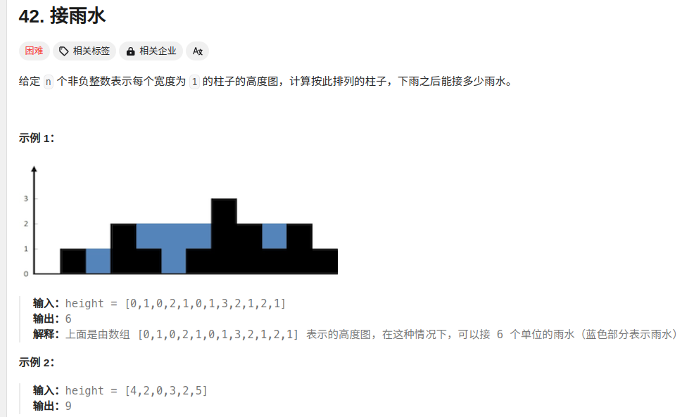

```c
class Solution {
public:
    int trap(vector<int>& height) {
        int ans = 0;
        stack<int> stk;
        int n = height.size();
        for(int i= 0;i<n;i++){
            while(!stk.empty()&&height[i]>height[stk.top()]){
                int top = stk.top();
                stk.pop();
                if(stk.empty()){
                    break;
                }
                int left  = stk.top();
                int currWidth = i - left - 1;
                int curHight = min(height[left], height[i]) - height[top];
                ans += currWidth*curHight;
            }
            stk.push(i);
        }
        return ans;
    }
};
```