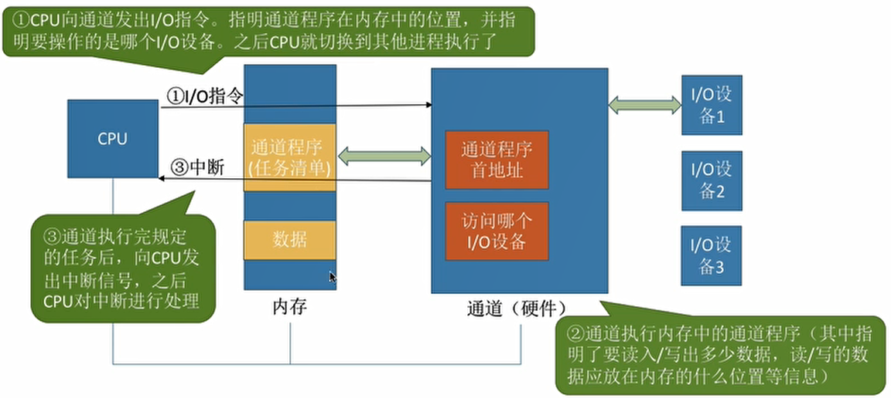
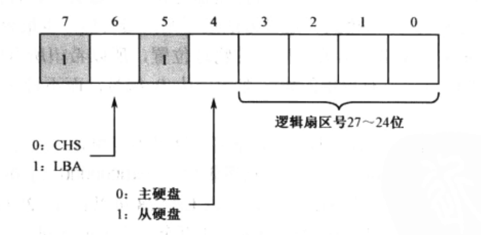
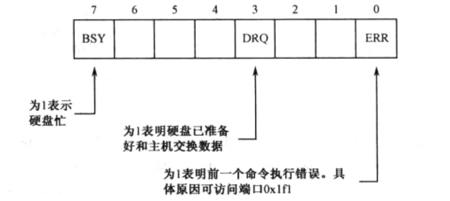
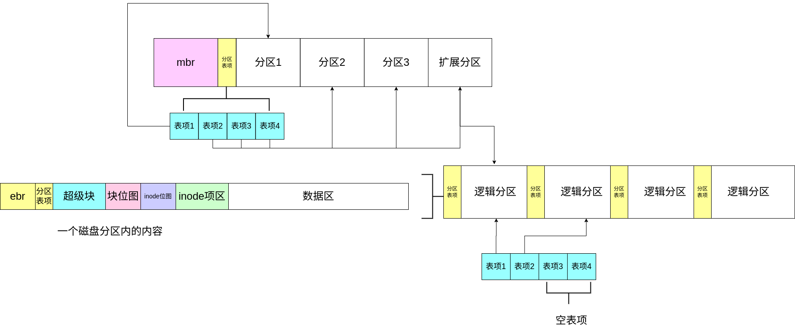
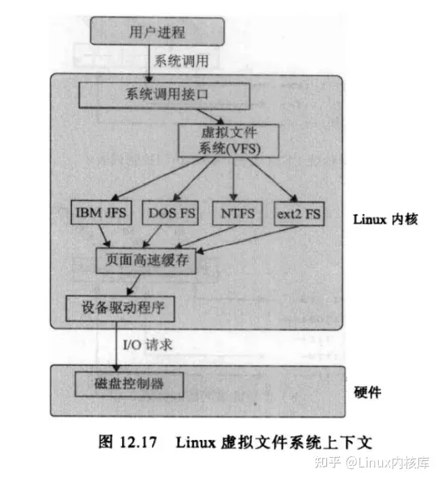
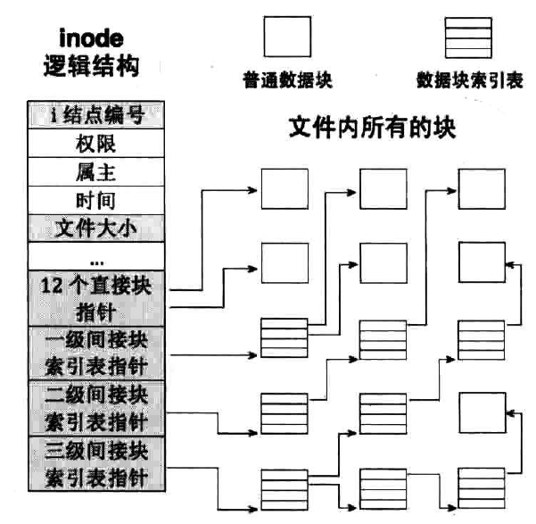

# 文件系统
## 磁盘
提到文件系统自然离不开作为存储介质的磁盘设备。
### 磁盘的物理结构
磁盘中内部有很多个盘片，上面充满了磁性物质用来储存信息。\
每个盘面都被划分为数目相等的磁道，并从外缘开始编号（即最边缘的磁道为0磁道，往里依次累加）。一般512字节为一个扇区\
如此磁盘中具有相同编号的磁道会形成一个圆柱，此圆柱称为磁盘的柱面。磁盘的柱面数与一个盘面上的磁道数是相等的。由于每个盘面都有一个磁头，因此，盘面数等于总的磁头数。\
  
在读写磁盘时，要先找到指定的扇区号再向其中写入内容，这两个步骤都会花费较长的时间，因此磁盘相对于内存是一种低速存储设备。
### 磁盘中断
作为外设磁盘的活动需要通过中断通知给cpu。\
在此过程中还有一个名为通道的设备。磁盘通过通道向cpu发出中断。\
一个通道对应两块磁盘。每个通道有自己对应的端口基址和中断引脚。
  
代码实现：
```c
//通道结构体
struct ide_channel {
    char name[8];
    uint32_t port_base;//起始端口号
    uint8_t inr_no;//中断号
    struct lock c_lock;//通道锁，一个通道上有两个磁盘吗，为了保证操作原子信，需要锁
    bool expect_intr;//是否等待中断
    struct semaphore disk_down;//信号量
    struct disk devices[2];//两个磁盘
};
//磁盘结构体
struct disk {
    char name[8];
    struct ide_channel* mychannel;//磁盘的通道
    uint8_t dev_no;//标记是主盘还是从盘
    struct partition mian_parts[4];//四个主分区
    struct partition logic_parts[4];//八个逻辑分区

};
```
### 磁盘端口
磁盘的端口有3类，分别是读写端口，控制端口，状态端口。
#### 读写端口
跟读写相关的端口有磁盘选择端口，扇区选择端口，数据端口\
一个通道对应了两个磁盘。分别为从盘和主盘。\
扇区选择端口一共有四个，共32位。前28位填写的是待操作的扇区号,后四位则是读写时的标志位。
  

#### 控制端口
通过向磁盘的控制端口中写入指令，可以设置磁盘的读写或获取磁盘信息
```c
#define CMD_IDENTIFY	   0xec	    // identify指令获取磁盘信息
#define CMD_READ_SECTOR	   0x20     // 读扇区指令
#define CMD_WRITE_SECTOR   0x30	    // 写扇区指令
```
#### 状态端口
  

磁盘状态端口中的八位分别对应着磁盘的状态。通过读取磁盘状态端口中的内容来判断磁盘当前的状态。
### 磁盘读写控制流程
在前文中提到了磁盘io需要时间\
  
读和写的信号量down操作时间并不相同，读的down操作是在选择读磁盘之前，当发出读命令时磁盘就会开始工作\
而写的down是在写磁盘之后，将内容写入端口中之后磁盘才会开始工作
### 磁盘的逻辑结构
  
以下两个结构体对应了图中引导扇区和引导扇区中的分区表项
```c
/* 引导扇区,mbr或ebr所在的扇区 */
struct boot_sector {
   uint8_t  other[446];		 // 引导代码
   struct   partition_table_entry partition_table[4];       // 分区表中有4项,共64字节
   uint16_t signature;		 // 启动扇区的结束标志是0x55,0xaa,
} __attribute__ ((packed));
```
磁盘分区表项：
```c
struct partition_table_entry {
   uint8_t  bootable;		 // 是否可引导	
   uint8_t  start_head;		 // 起始磁头号
   uint8_t  start_sec;		 // 起始扇区号
   uint8_t  start_chs;		 // 起始柱面号
   uint8_t  fs_type;		 // 分区类型
   uint8_t  end_head;		 // 结束磁头号
   uint8_t  end_sec;		 // 结束扇区号
   uint8_t  end_chs;		 // 结束柱面号
/* 更需要关注的是下面这两项 */
   uint32_t start_lba;		 // 本分区起始扇区的lba地址
   uint32_t sec_cnt;		 // 本分区的扇区数目
} __attribute__ ((packed));	 // 保证此结构是16字节大小
```
磁盘分区信息：
```C
struct partition {
   uint32_t start_lba;		 // 起始扇区
   uint32_t sec_cnt;		 // 扇区数
   struct disk* my_disk;	 // 分区所属的硬盘
   struct list_node part_tag;	 // 用于队列中的标记
   char name[8];		 // 分区名称
   struct super_block* sb;	 // 本分区的超级块
   struct bitmap block_bitmap;	 // 块位图
   struct bitmap inode_bitmap;	 // i结点位图
   struct list open_inodes;	 // 本分区打开的i结点队列
};
```
## 文件系统的概念
### 一切皆文件的思想
### 虚拟文件系统
>虚拟文件系统（Virtual File System，简称VFS）是Linux内核的子系统之一，它为用户程序提供文件和文件系统操作的统一接口，屏蔽不同文件系统的差异和操作细节。借助VFS可以直接使用open()、read()、write()这样的系统调用操作文件，而无须考虑具体的文件系统和实际的存储介质。\
Linux用户程序可以通过read() 来读取ext3、NFS、XFS等文件系统的文件，也可以读取存储在SSD、HDD等不同存储介质的文件，无须考虑不同文件系统或者不同存储介质的差异。



一般一个文件系统（除去分布式文件系统）只能挂载在一个磁盘分区中。


### 目录结构


## 文件相关的数据结构
### 结构关系
   
普通文件与目录文件都被认为是文件，二者在系统层面的操作并无太大区别。普通文件中保存着文件内容，而目录文件中保存的则是目录项。
### inode
inode 是许多文件系统中使用的通用名称,用于描述保存给定文件的元数据的结构,例如其长度、权限以及其组成块的位置，并且inode是文件系统中文件的唯一标识。\
为什么需要inode？\
文件系统中会存储着许多文件，文件的大小，属主等等都有所不同，通过inode可以将这些信息组织到一起
* 通过使用inode，文件系统可以更快地定位和访问文件的元数据信息，从而提高文件访问的效率。
* inode可以帮助文件系统更有效地管理磁盘空间，允许存储更多的文件和目录。
```c
struct inode {
  uint32_t i_no;    // inode编号
  uint32_t i_size;  // 文件大小(若为目录，是指目录项大小之和)
  uint32_t i_open_cnts;  // 记录此文件被打开的次数
  bool write_deny;  // 写文件不能并行，进程写文件前检查此标识
  uint32_t i_sectors[13];  // 块的索引表，前12项为直接块，后1项为间接块
  struct list_node inode_tag;//用于将结构体挂上内核中inode打开队列
};
```
除此之外inode中还存储了文件的扇区号。因为文件有大有小，连续的存储会导致磁盘内的扇区碎片化。因此一份文件并不会被存储到连续的区域中。上图中的块位图就是标记哪片扇区是被使用过的。哪片是没被使用过的。\
块指针的前12个块都是直接指针，存储了扇区号，第13个则是间接指针，指向一个扇区，而该扇区中则存储着真正文件所在的扇区号\
  
inode中并没有存储文件名，对于系统来说inode号没有什么意义。\
用户使用的文件名和inode号会在file结构中被联系起来。

### super_block
超级块中存储这这片磁盘分区以及挂载文件系统相关信息。其中包含了块位图，inode位图，数据区的起始地址与尺寸以及文件系统的操作接口。
```c
struct super_block {
    uint32_t magic;          // 文件系统的标识类型
    uint32_t sec_cnt;        // 该磁盘分区的总扇区数
    uint32_t inode_cnt;      // 该分区的inode数量
    uint32_t part_lba_base;  // 本分区的lba地址

    uint32_t block_bitmap_lba;    // 块位图的起始地址
    uint32_t block_bitmap_sects;  // 扇区位图本身占用的扇区数量

    uint32_t inode_bitmap_lba;    // i结点位图起始扇区lba地址
    uint32_t inode_bitmap_sects;  // i结点位图占用的扇区数量

    uint32_t inode_table_lba;    // i结点表起始扇区lba地址
    uint32_t inode_table_sects;  // i结点表占用的扇区数量

    uint32_t data_start_lba;  // 数据区开始的第一个扇区号
    uint32_t root_inode_no;   // 根目录所在的I结点号
    uint32_t dir_entry_size;  // 目录项大小

    uint8_t pad[460];  // 加上460字节,凑够512字节1扇区大小
}__attribute__ ((packed));//对齐512字节
```
在初始化时会遍历链表上先前的所有分区，若该尚未挂载文件系统，则会为其挂载对应的文件系统。\
而在某一时刻，操作系统只使用一个文件系统内的信息。
```c
struct partition* cur_part;//记录了
```
