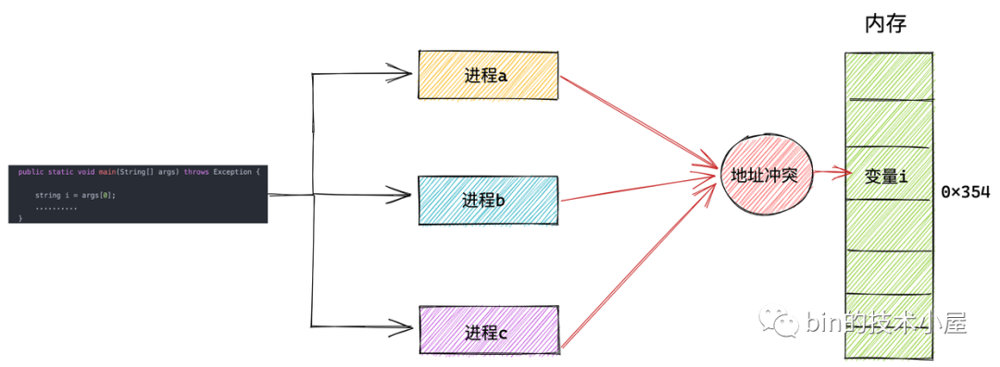
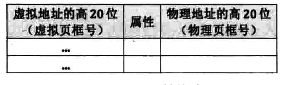
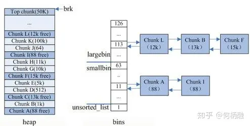

# 虚拟内存
## 首先要明确的几点问题
1.程序中你使用malloc申请获取的地址都是虚拟地址（纳新题）\
2.你电脑内部装有各种各样的硬件设施。寄存器用来暂时存储需要用到的某些值。\
3.一个正在运行的程序有4GB的可访问的虚拟地址空间，其中程序自身占据低3GB，操作系统占据高1GB\
4.计算机并不是一上电就开启了分页机制使用虚拟地址进行访问。而是先要经过一番折腾才能艰难的开启分页机制。
## 为什么需要虚拟内存技术
早期计算机中，并未引入虚拟内存的概念。\
明明直接访问物理地址简单快捷为何又要使用虚拟内存？
### 计算机硬件资源有限
早期计算机中只运行单一或几个简单的程序。\
但在当今时代，人们对计算机的性能要求越来越高，为了打破硬件的限制。发展出许多虚拟化技术。虚拟内存技术就是其中之一。
### 内存碎片化
每次一个程序的指令总是渴望放在一片连续的空间内。但直接分配内存可能会导致内存的碎片化。\
  
例如上图，虽然此时内存总量大于申请的空间。但是因为碎片化的分布，导致无法为程序分配出相应的空间。
### 进程间的隔离
  

若直接使用物理内存，电脑上诸多进程都要小心翼翼的记住其他进程的领地。如果不小心触碰到其他进程的领地就会导致数据的错乱甚至程序的崩溃。虚拟地址的出现将进程之间彻底隔离开由操作系统统一管理。
  
在使用了虚拟内存之后，进程就以为自己独占了整个内存空间资源，给进程产生了所有内存资源都属于它自己的幻觉，这其实是 CPU 和操作系统使用的一个障眼法罢了，任何一个虚拟内存里所存储的数据，本质上还是保存在真实的物理内存里的。只不过内核帮我们做了虚拟内存到物理内存的这一层映射，将不同进程的虚拟地址和不同内存的物理地址映射起来。
## 硬件支持
虚拟内存技术的实现并非只需要软件的空中楼阁，还需要硬件层面提供的支持。
### MMU
MMU用于将虚拟内存地址转化为物理内存地址。
### TLB
倘若每次都计算虚拟内存地址，不仅非常麻烦MMU，还会占用一定量的资源。\
因此，TSL的存在可以将常用的虚拟地址与物理地址一一对应并将他们储存起来，这样就会大大减轻MMU的工作量。
  
### 寄存器cr3
MMU只负责计算，那么谁来帮助他记住页目录项的物理地址？\
cr3在寄存器中存储了页目录的物理地址。这样MMU就可以直接通过他获取到页目录的虚拟地址进行运算了。
## 寻址方式
### 什么是页
我们人为规定一页的大小对应了物理内存中4096字节\
   
<u><big>页目录与页表也会占用一个自然页的空间！！！</big></u>
  
64位下的寻址更加复杂，引入了更多级别的页表，但是思想和简单的32位还是一样，只不过是又多绕了几个层级的路\
  

## 进程内存布局
  

## 分页机制软件层面的实现思路
  
<u><big>图中1M只是举例，实际有多大的一对一映射区取决于操作系统的设计者</big></u>
### 为什么存在一一对应的映射区域
在还未开启分页机制前，就存在很多老程序通过物理地址直对内存进行访问。\
为了使老东西能适应分页机制的新制度，操作系统只能将一部分内存割让出来，让虚拟地址和物理地址一一对应起来以便老东西住的舒服。
## 内存的分配
内存的分配分为物理地址的分配和虚拟地址的分配。
### 位图
如何标记这块内存有没有被使用过?\
如果一块内存就使用一个字节甚至更多来记录难免有些太过奢侈。在这里为了节省计算机中的资源，我们引入了位图的概念。只需要一个比特位就能记录一大块内存是否被使用过。非常的简单便捷。
  
在分配虚拟地址时只用使用位运算找到一片连续的0就可以了。而物理地址每次都是一页一页分配。

### 写时分配
为了节省内存，虚拟内存在分配之后并未分配对应的物理内存。只有在向内存中写入内容时，才会引发缺页中断，提醒操作系统为虚拟内存分配对应的物理内存。\
要为虚拟地址分配物理内存，同样要通过位图查找到没有被使用过的物理内存页。\
当找到未被使用的物理页时，要将物理地址填入到对应的页表内。此时判断页表是否存在，如果页表不存在，先为页表分配一个物理页。再将分配的物理地址能填入页表内。
### 虚拟内存的分配
  

### malloc与内存池
malloc函数
  
malloc函数只是一层封装，它的底层包含了brk()函数和mmap()函数。\
* 如果用户分配的内存小于 128 KB，则通过 brk() 申请内存；
* 如果用户分配的内存大于 128 KB，则通过 mmap() 申请内存；
  
free()释放内存：
* malloc 通过 brk() 方式申请的内存，free 释放内存的时候，并不会把内存归还给操作系统，而是缓存在 malloc 的内存池中，待下次使用；
* malloc 通过 mmap() 方式申请的内存，free 释放内存的时候，会把内存归还给操作系统，内存得到真正的释放。
#### 封装malloc的原因
brk()与mmap()函数都是系统调用，从用户态切换到内核态需要消耗时间与计算机资源。
malloc在实现时使用池化的理念。先申请一大块内存，然后将内存分成不同大小的内存块，然后用户申请内存时，直接从内存池中选择一块相近的内存块即可。
#### malloc的实现

malloc将内存大小分为大小不同的块，将相同大小的块使用结构体记录其信息，例如起始地址等等。并将大小相同的块组织到一条链表上。\
  
  

malloc一共维护了128个bin，并使用一个数组来存储这些bin。\
unsorted bin:\
数组中第一个为unsorted bin。\
small bin：\
数组从2开始编号，前64个bin为small bins，同一个small bin中的chunk具有相同的大小，两个相邻的small bin中的chunk大小相差8bytes。\
large bin：\
small bins 后面的 bin 被称作 large bins。large bins中的每一个 bin 分别包含了一个给定范围内的chunk，其中的chunk按大小序排列。large bin的每个bin相差64字节。
fast bins：\
除了在数组中存储的结构之外，还有一个名为fast bins,将一些零散的内存小块（小于64B）组织到一起。在某个特定的时候,malloc 会遍历 fast bins 中的 chunk,将相邻的空闲 chunk 进行合并,并将合并后的 chunk 加入 unsorted bin 中,然后再将 usorted bin 里的 chunk 加入 bins 中。\
glibc中用于维护空闲内存的结构体是malloc_state:
```c
struct malloc_state {
    mutex_t mutex; // 并发编程下锁的竞争
    mchunkptr        top; // top chunk
    unsigned int     binmap[BINMAPSIZE]; // bitmap，加快bins中chunk判定
    mchunkptr        bins[NBINS * 2 - 2]; // bins，上文所述
    mfastbinptr      fastbinsY[NFASTBINS]; // fastbins，类似bins，维护的chunk更小(80字节的chunk链表)
...
}
```
### brk()
  

### mmap()

```c
void* mmap(void* addr, size_t length, int prot, int flags, int fd, off_t offset);
```
* addr：映射的起始地址。通常传入 NULL，让系统自动选择合适的地址。

* length：映射的长度，以字节为单位。

* prot：指定映射区域的保护方式，可以是以下几个值的按位或（|）组合：

    PROT_READ：可读。\
PROT_WRITE：可写。\
PROT_EXEC：可执行。\
PROT_NONE：无权限。\
* flags：标志位，指定映射的一些特性，可以是以下几个值的按位或：

    MAP_SHARED：共享映射，多个进程可以共享映射的同一段内存。\
MAP_PRIVATE：私有映射，每个进程都有一份独立的映射。\
MAP_FIXED：强制使用指定的地址，如果这个地址已经被占用，mmap 会失败。\
MAP_ANONYMOUS：映射匿名内存，不和任何文件关联。\
MAP_GROWSDOWN：用于堆栈，使得堆栈可以向下扩展。
* fd：文件描述符，如果映射的是文件，则传入文件的描述符。如果是匿名映射，则传入 -1。

* offset：文件映射的偏移量，表示从文件的哪个位置开始映射。对于匿名映射，通常设置为 0。

MAP_PRIVATE | MAP_ANONYMOUS 表示私有匿名映射，我们常常利用这种映射方式来申请虚拟内存  

  
当mmap分配虚拟地址时，会根据用户系统调用的需求，在映射区寻找一块虚拟地址，将他们的信息通过结构体vm_area_struct组织起来，将其加入队列和红黑树之中。
```c
struct vm_area_struct {
    struct mm_struct *vm_mm;    /* 我们所属的地址空间 */
    unsigned long vm_start;     /* 在 vm_mm 中的起始地址 */
    unsigned long vm_end;       /* 在 vm_mm 中结束地址后的第一个字节 */
    /* ... 用于内存区域各种属性的其他字段 ... */
    struct vm_area_struct *vm_next; /* 任务的内存区域的链表，按地址排序 */
};
```
### 如果物理页不够了怎么办？
当物理内存不够时，会引发缺页中断。进而中断处理程序会将物理内存中一些长期没使用的页通过交换技术将其放入磁盘中保存。\
简单来说就是通知cpu说地方不够了，把没用的东西从内存里丢出去。
  
