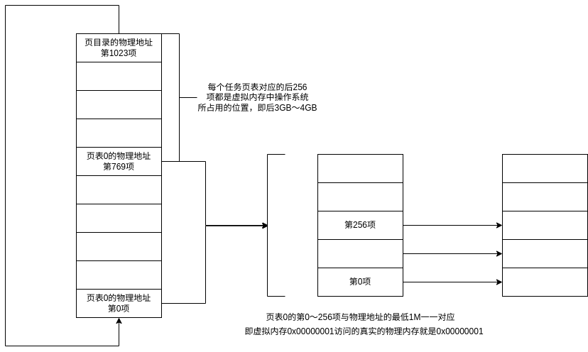
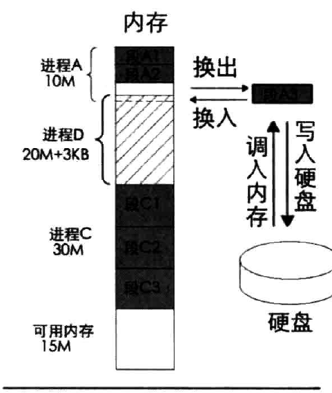

# 虚拟内存技术
## 首先要明确的几点问题
1.程序中你使用malloc申请获取的地址都是虚拟地址（纳新题）\
2.你电脑内部装有各种各样的硬件设施。寄存器用来暂时存储需要用到的某些值。\
3.一个正在运行的程序有4GB的可访问的虚拟地址空间，其中程序自身占据低3GB，操作系统占据高1GB\
4.计算机并不是一上电就开启了分页机制使用虚拟地址进行访问。而是先要经过一番折腾才能艰难的开启分页机制。
## 为什么需要虚拟内存技术
早期计算机中，并未引入虚拟内存的概念。\
明明直接访问物理地址简单快捷为何又要使用虚拟内存？
### 计算机硬件资源有限
早期计算机中只运行单一或几个简单的程序。\
但在当今时代，人们对计算机的性能要求越来越高，为了打破硬件的限制。发展出许多虚拟化技术。虚拟内存技术就是其中之一。
### 内存碎片化
每次一个程序的指令总是渴望放在一片连续的空间内。但直接分配内存可能会导致内存的碎片化。\
  
例如上图，虽然此时内存总量大于申请的空间。但是因为碎片化的分布，导致无法为程序分配出相应的空间。
## 硬件支持
虚拟内存技术的实现并非只需要软件的空中楼阁，还需要硬件层面提供的支持。
### MMU
MMU用于将虚拟内存地址转化为物理内存地址。
### TLB
倘若每次都计算虚拟内存地址，不仅非常麻烦MMU，还会占用一定量的资源。\
因此，TSL的存在可以将常用的虚拟地址与物理地址一一对应并将他们储存起来，这样就会大大减轻MMU的工作量。
  

### 寄存器cr3
MMU只负责计算，那么谁来帮助他记住页目录项的物理地址？\
cr3在寄存器中存储了页目录的物理地址。这样MMU就可以直接通过他获取到页目录的虚拟地址进行运算了。
## 寻址方式
### 什么是页
我们人为规定一页的大小对应了物理内存中4096字节\
   
<u><big>页目录与页表也会占用一个自然页的空间！！！</big></u>
  
64位下的寻址更加复杂，引入了更多级别的页表，但是思想和简单的32位还是一样，只不过是又多绕了几个层级的路\
  

## 进程内存布局
  

## 软件层面的实现思路
  
<u><big>图中1M只是举例，实际有多大的一对一映射区取决于操作系统的设计者</big></u>
### 为什么存在一一对应的映射区域
在还未开启分页机制前，就存在很多老程序通过物理地址直对内存进行访问。\
为了使老东西能适应分页机制的新制度，操作系统只能将一部分内存割让出来，让虚拟地址和物理地址一一对应起来以便老东西住的舒服。
## 内存的分配
内存的分配分为物理地址的分配和虚拟地址的分配。
### 位图
如何标记这块内存有没有被使用过?\
如果一块内存就使用一个字节甚至更多来记录难免有些太过奢侈。在这里为了节省计算机中的资源，我们引入了位图的概念。只需要一个比特位就能记录一大块内存是否被使用过。非常的简单便捷。
  
在分配虚拟地址时只用使用位运算找到一片连续的0就可以了。而物理地址每次都是一页一页分配。
### 简单分配以页为单位的内存
  
### 更加细节的分配malloc

### 如果物理页不够了怎么办？
当物理内存不够时，会引发缺页中断。进而中断处理程序会将物理内存中一些长期没使用的页通过交换技术将其放入磁盘中保存。\
简单来说就是通知cpu说地方不够了，把没用的东西从内存里丢出去。
  
