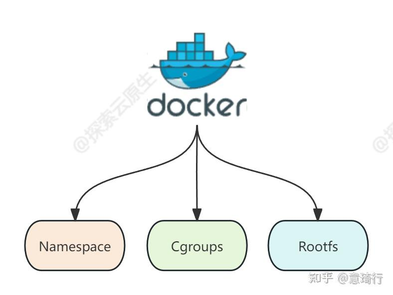

# 进程与线程
## 进程与线程之间的关系
我们先看线程与进程各自的定义\
进程：
>进程（Process）是计算机中的程序关于某数据集合上的一次运行活动，是系统进行资源分配的基本单位

线程：
>计算机科学中的线程是同时运行多个任务或程序的执行。 每个能够执行代码的单元称为线程。

对于cpu来讲，它根本不知道线程和进程到底是什么。它只负责从内存中取出指令执行，并将结果存入对应的内存中。无论是进程还是线程在cpu的眼中只有一段一段的指令。这些指令组成不同的执行流。\
  

那二者之间又存在什么区别？\
进程是在内核线程的基础上实现的。两者间唯一的区别是是否有自己独立的虚拟地址空间。进程有自己的虚拟地址空间。
>线程是什么?具有能动性、执行力、独立的代码块。\
进程是什么?进程=线程+资源。根据进程内线程的数量,进程可分为。\
(1 )单线程进程:如果厨房中只有一个工作人员,即配菜、炒菜、洗涮厨具等这几样工作都是一个人做,那么厨房的工作效率必然会很低,因为此时厨房中就一个线程。\
(2 )多线程进程 z 厨房人手多了,工作才更高效,因此为配菜、炒菜、洗涮厨具专门配备了 3 个工作人员,也就是说进程内的线程多了。\
——《操作系统真相还原》
## 线程与进程存在的意义
为什么可以直接执行一个程序，却还要搞出进程线程这些不同的概念？\
现代计算机在被使用时总是非常忙碌的。电脑使用者可能一边要播放音乐，一边聊天，一边使用办公软件。\
然而cpu就只有那么多，那又该如何在有限的硬件资源的基础上实现对于性能的无限的扩展？\
进程线程的诞生便是为了解决这个问题。\
cpu通过调度来保证每一段程序都能得到运行，进而造成一种所有程序在同时执行。但实际上在那一瞬间只有特定的一段指令被执行。单核cpu并不存在真正的并行。
  
  

## 硬件基础
上文中提到了通过时间片轮转使得cpu能够雨露均沾，执行不同的程序，而不是等待一个程序全部执行完毕后再去执行另一个程序。\
那么便引出以下三个问题:
* 时间由谁来计算？
* 怎样将正在执行中的任务叫停？
* 被切换任务的状态的任务状态由谁来保存？
### 8253
8253为时钟芯片\
  
该芯片通过时钟脉冲来计算时间的流逝。\
当达到人为他设置好的时间后便会发出中断，告诉cpu说：“时间到了，该下一个了。”\
这块芯片是可以通过人为编程来控制的，只需将相应的控制字写入对应的端口中便可完成模式的选择。
### 8259A
8259A为中断控制芯片\

任务的叫停便是通过他来完成。当计时器8253向8259A发出中断说时间到。cpu便会转向这条中断对应的处理程序来执行。\
而在时钟中断的处理程序中会调用调度器相关的函数，从而达到切换执行流的目的。
## 内核线程的实现
### pcb任务控制块
pcb对于线程十分的重要。其中记录了线程的相关信息。\
以下为一个简单的pcb结构体示例。在真实的操作系统源码中pcb中包含着更多的内容
```c
struct task_struct {
  uint32_t* self_kstack;  // 各内核线程都用自己的内核栈
  pid_t pid;//进程号
  enum task_status status;//当前任务状态
  char name[16];
  uint8_t priority;        // 线程优先级
  uint8_t ticks;           // 每次在处理器上执行的时间嘀嗒数
  uint32_t elapsed_ticks;  // 运行时间嘀嗒总数（总运行时间）

  int32_t fd_table[MAX_FILES_OPEN_PER_PROC];  // 文件描述符数组

  struct list_elem general_tag;  // 用于线程在一般的队列(就绪/等待队列)中的结点
  struct list_elem all_list_tag;  // 总队列(所有线程)中的节点

  uint32_t* pgdir;                     // 进程自己页表的虚拟地址
  struct virtual_addr userprog_vaddr;  // 放进程页目录表的虚拟地址
  struct mem_block_desc u_block_desc[DESC_CNT];  // 用户进程内存块描述符
  uint32_t cwd_inode_nr;  // 进程所在的工作目录的inode编号
  int16_t parent_pid;     // 父进程的pid
  int8_t exit_status;     // 进程结束时自己调用exit传入的返回值
  uint32_t stack_magic;   // 栈的边界标记,用于检测栈的溢出
};
```
#### thread_stack线程栈
在提出的三点问题中通过硬件解决了前两个问题。而第三个问题是通过软件解决的。
```c
struct thread_stack
{
    //根据ABI的约定，将寄存器压栈保存
    uint32_t ebp;
    uint32_t ebx;
    uint32_t edi;
    uint32_t esi;
    //以下是线程第一次被调度上cpu时需要初始化的信息
    void (*eip)(thread_func* func, void* func_arg);//函数指针，第一次被调度时指向kernel_thread函数，再由kernel_thread函数调用线程执行的目的函数
    void (*unused_retaddr);//用来占位，充当调用kernel_thread函数的返回地址
    thread_func* function;   // 由Kernel_thread所调用的函数名
    void* func_arg;    // 由Kernel_thread所调用的函数所需的参数
};
```
#### intr_stack中断栈
```c
struct intr_stack
{
    uint32_t vec_no;	 // kernel.S 宏VECTOR中push %1压入的中断号
    uint32_t edi;
    uint32_t esi;
    uint32_t ebp;
    uint32_t esp_dummy;	 // 虽然pushad把esp也压入,但esp是不断变化的,所以会被popad忽略
    uint32_t ebx;
    uint32_t edx;
    uint32_t ecx;
    uint32_t eax;
    uint32_t gs;
    uint32_t fs;
    uint32_t es;
    uint32_t ds;
    uint32_t err_code;		 // err_code会被压入在eip之后
    void (*eip) (void);//指令指针
    uint32_t cs;
    uint32_t eflags;
    void* esp;//特权级更换时需要切换特级栈
    uint32_t ss;
};
```
### 多线程环境的初始化
在操作系统刚被载入时便会完成多线程环境的初始化。\
要支持多线程环境，根据上文中的分析首先要初始化中断和定时器两个调度所依赖的基石。\
其次还需要初始化任务队列。其中有一个队列用于记录所有对列。其余队列用于记录不同状态的线程。\
最后将正在执行的线程初始化为主线程。（此时操作系统中只有这一个线程）
### 内核线程初始化
内核线程的初始化比较简单，只需将pcb结构体中的各项内容填好就好了。\
 但是在这里我们还有一个问题，* self_kstack究竟指向intr_stack中断栈还是thread_stack线程栈 ?\
首先两个栈在pcb之中都占有一席之地。但究竟使用哪个决定权在于* self_kstack指针指向哪个栈。\
而决定使用哪个的依据是调度过程是否发生特权级的转换。

## 用户进程的实现
### TR寄存器与TSS
TSS与TR\
TSS段中记录了任务执行的状态\
  
TR寄存器中存储着当前的任务对应的TSS段：\
  
当任务被嵌套调用时，存在任务调用链。\
  

## 用户线程的实现
## 调度器与调度过程